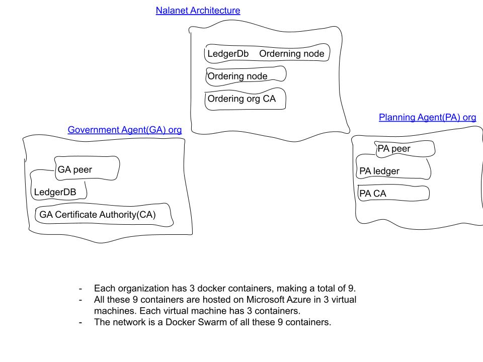

# About
`Nalanet` is a permissioned blockchain network built on top of Hypeledger Fabric that aims to provide safer and more accurate decentralized storage of information on land ownership in Rwanda. 
# Origin Story
Rwanda is a bit of a magical place! Awesome place to call home. I am a little biased of course. That being said, however, land ownership has been traditionally a major source of interpersonal conflicts. How do you know who owns what land? What happens when someone rightly or falsely claims that a piece of land belongs to them? For a long time, there were paper certificates. But those could easily be forged, leading to even more conflicts and court cases. I hope that's starting to sound like a serious data problem. If not yet, I will define it more concretely. 

In 2018, The UK GDPR Article five set out seven [principles](https://ico.org.uk/for-organisations/guide-to-data-protection/guide-to-the-general-data-protection-regulation-gdpr/principles/) to safeguard personal data. Among the others, I would like to pay a special attention to the sections d and f. They dictate that personal data should be accurate and safe from potential destruction or damage. 
- "(d). accurate and, where necessary, kept up to date; every reasonable step must be taken to ensure that personal data that are inaccurate, having regard to the purposes for which they are processed, are erased or rectified without delay (‘accuracy’);
-  (f). processed in a manner that ensures appropriate security of the personal data, including protection against unauthorised or unlawful processing and against accidental loss, destruction or damage, using appropriate technical or organisational measures (‘integrity and confidentiality’).”

Now, as far as section (d) is concerned, Rwanda has taken some serious giant steps in the right direction. Every land is registered in a system that keeps track of who owns what and where. The friction is reduced, to a degree. That has lead to reduction in property conflicts. 

The problem, for which we are proposing a potential solution is section (f). Personal data should be processed in "a manner that ensures appropriate security." In Rwanda's case, land data is centrally stored in a few databases. They are subject to hacking and data loss. As a result of this centralization, it still takes months for one to obtain a new certificate if they happened to, say, buy land. The data has to be validated by multiple government departments, the city planning, the tax, etc. Each taking months and updating their record. To push the needle on this problem, we proposed **`nalanet`**.

Oh and by the way, I'll let you in on a little secret. You just have to promise not to tell anyone. [**`Nala`**](https://www.wordhippo.com/what-is/the-meaning-of/korean-word-bfd360c3b501756f751f4c447148df1ba5b1eca9.html) translates to land in Korean! Just between you and me. 

# Tell me more about Nalanet

We are more than happy to. **`Nalanet`**, unlike [Ba Sing Se](https://avatar.fandom.com/wiki/Ba_Sing_Se), is quite penetrable and everything is what it seems. To know more about Nalanet, some basic Blockchain knowledge would go a long way. So here is some.

### A Word on Blockchain
It's quite simple. Block means data. Chain means storage or record. But wait, that's too easy, no? Well, one more thing. That record/chain/database/ledger is duplicated across multiple nodes(computers). That's all that Blockchain is. That dupliction part is not so simple in practice, but that's all there is to it. Since blockchain can be complicated in practice, we have taken advantage of the amazing tools(frameworks and libraries) in the community to build `Nalanet`. 
### Now, what exactly is Nalanet?
`Nalanet` is a permissioned blockchain network built on top of Hypeledger Fabric that aims to provide safer and more accurate decentralized storage of information on land ownership in Rwanda. 

## Architecture Flow

## Included Components
* Azure Cloud Virtual Machines
* Heroku ..
* DFINITY ..
* Hyperledger Fabric -> Azure
* Authentication DB -> MySQL on Google Cloud
* Express.js Server -> Heroku
* React Frontend -> Dfinity

## Featured Technologies
* [Hyperledger]() is Hyperledger is an open source community focused on developing a suite of stable frameworks, tools and libraries for enterprise-grade blockchain deployments.
* [Hyperledger Fabric]() is a frameworks under the umbrella of `Hyperledger` focused building enterprise blockchain networks. If you would like to learn more about Hyperledger, you could checkout our [notes]() on the framework. 
* [Nodejs](https://nodejs.org/en/) is an open-source, cross-platform JavaScript run-time environment that executes JavaScript code server-side.

* [Docker](https://www.docker.com/) is a computer program that performs operating-system-level virtualization, also known as Containerization.
* React
* Azure Ubuntu Virtual machines. 
* Shell scriping
* Go
* Docker Swarm
## Prerequisites

# Running the Project Locally
1. Set up your machine
2. Get the right binaries
3. clone the repository
4. Create a solution
5. Clone the repository
6. Modify the configuration files
7. Run the application
# Future Steps
Right now the project is still in its infancy. We only have two organizations on our network. And land owners don't have access to the network. As next steps, we would to:
1. Add A few more organizations
2. Enable Land Owners to have access to the network
3. (Hopefully)Pitch the project to the Rwanda Development Board. 
# Final Word
You could very well ask, what do we know about land? And that would be a fair question. The answer is, quite frankly, not much. But there's a fundamental problem, and it doesn't take much to see what it is, so we won't take credit for that. Applying for a land certificate in Rwanda is kind of a pain. Data is fragmented and various departments have to work to gether to try to sync data across a few decentralized dbs. that has to change. I am not by any means implying that we completely solved the problem; only a tiny step in the right direction, we hope. 
# License

MIT License

Copyright (c) 2021 Open Sourced Olaf

Permission is hereby granted, free of charge, to any person obtaining a copy
of this software and associated documentation files (the "Software"), to deal
in the Software without restriction, including without limitation the rights
to use, copy, modify, merge, publish, distribute, sublicense, and/or sell
copies of the Software, and to permit persons to whom the Software is
furnished to do so, subject to the following conditions:

The above copyright notice and this permission notice shall be included in all
copies or substantial portions of the Software.

THE SOFTWARE IS PROVIDED "AS IS", WITHOUT WARRANTY OF ANY KIND, EXPRESS OR
IMPLIED, INCLUDING BUT NOT LIMITED TO THE WARRANTIES OF MERCHANTABILITY,
FITNESS FOR A PARTICULAR PURPOSE AND NONINFRINGEMENT. IN NO EVENT SHALL THE
AUTHORS OR COPYRIGHT HOLDERS BE LIABLE FOR ANY CLAIM, DAMAGES OR OTHER
LIABILITY, WHETHER IN AN ACTION OF CONTRACT, TORT OR OTHERWISE, ARISING FROM,
OUT OF OR IN CONNECTION WITH THE SOFTWARE OR THE USE OR OTHER DEALINGS IN THE
SOFTWARE.

